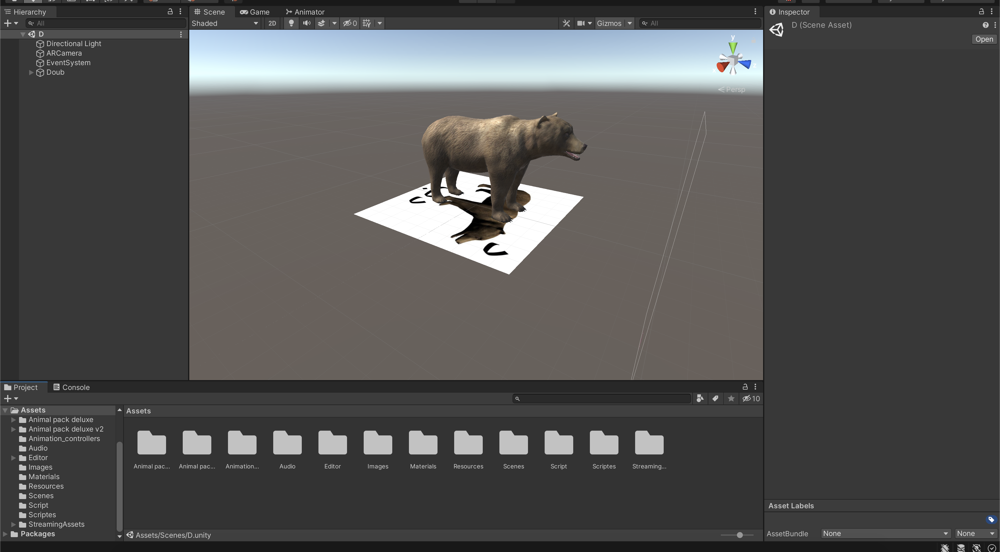

# kids_learning

kids_learning is a Unity application whenn kids can learn arabic alphabet.

## Getting Started
### Prerequisites

- Latest verison of Unity that can be downloaded from [here](https://unity3d.com/get-unity/download). This sample game was tested using Unity 2020.3.0f1.
- The game was tested on Android, but one should be able to port it to other platforms too.
- [vuforia plugin](https://library.vuforia.com/getting-started/getting-started-vuforia-engine-unity)

## Contributing
Pull requests are welcome. For major changes, please open an issue first to discuss what you would like to change.

Please make sure to update tests as appropriate.

## License
[MIT](https://choosealicense.com/licenses/mit/)
